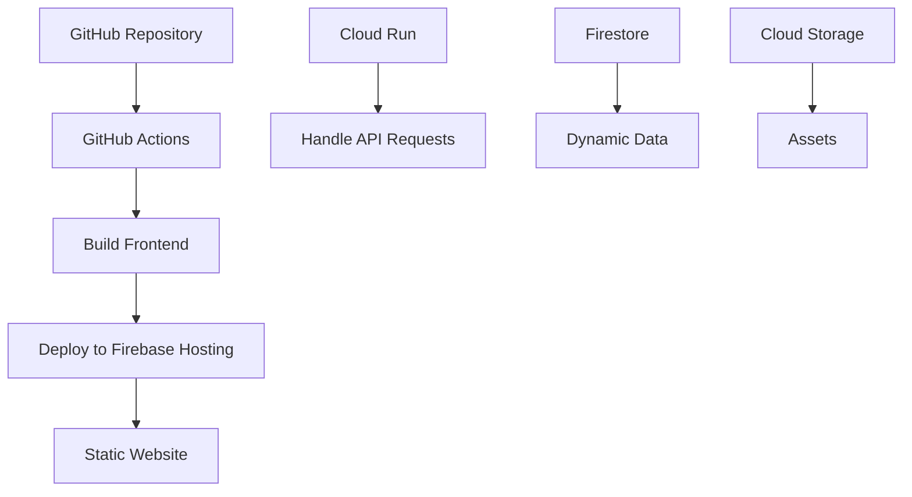
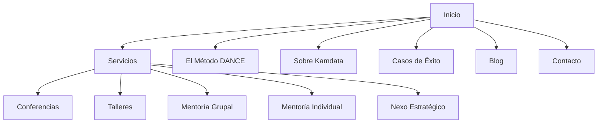

# 🧠 Kamdata Website Cloud development & Architecture Design 

This repository contains the code and infrastructure for the Kamdata website, a website designed to enable professionals and teams to turn data into strategic decisions through mentoring and practical training.

## Project Overview

The Kamdata website is built using a serverless architecture on Google Cloud Platform (GCP) with Firebase integration, ensuring scalability, security, and ease of maintenance.

## Architecture

- **Frontend**: React.js with Tailwind CSS, hosted on Firebase Hosting for global CDN delivery.
- **Backend**: Cloud Functions for Firebase to handle server-side logic (e.g., form submissions).
- **Database**: Firestore for dynamic data storage (if required).
- **Storage**: Cloud Storage for large assets (if required).

### Architecture Diagram


## 🚀 Technical Specifications

### 🖥 Programming Languages

- **Frontend:** JavaScript (React.js)
- **Backend:** Node.js (Cloud Functions)
- **Infrastructure:** HCL (Terraform)

### 📦 Packages and Dependencies

#### Frontend:
```json
"react": "^18.2.0",
"react-dom": "^18.2.0",
"react-router-dom": "^6.4.0",
"tailwindcss": "^3.2.0"
```

#### Backend:
```json
"firebase-functions": "^4.0.0",
"firebase-admin": "^11.0.0"
```

#### Development Tools:
- `firebase-tools`: ^11.0.0 (global install)
- `terraform`: ^1.3.0 (for IaC)

---

### 🌐 Browserslist

Defined in `.browserslistrc`:

```
> 0.5%
last 2 versions
not dead
```

---

## 🎨 CSS & Styling

- **Framework:** Tailwind CSS
- **Fonts:** Montserrat (headings), Lato (body)
- **Configured in:** `frontend/tailwind.config.js`
- **Colors Palette:**
🎯 Hunyadi Yellow (#E8AC41) → Llamados a la acción, claridad
⚡ Strawberry (#FC4C4E) → Mentalidad digital, transformación
🔵 Cerulean (#0492C2) → Metodologías, estructura, confianza

---

## 🔒 Lockfile

- Dependency locking with `package-lock.json` ensures consistent builds.

---

## 📦 Containers

- No Docker containers are used.
- Firebase Hosting and Cloud Functions provide serverless environments.

---

## ✅ Prerequisites

Ensure the following are installed:

- Node.js and npm
- Firebase CLI (`npm install -g firebase-tools`)
- Google Cloud SDK
- Terraform (`>= 1.3.0`)
- GCP Project with **Billing Enabled**

---

## ⚙️ Setup Instructions

### 1. Clone the Repository

```bash
git clone https://github.com/username/kamdata-website.git
cd kamdata-website
```

### 2. Install Frontend Dependencies

```bash
cd frontend
npm install
```

### 3. Initialize Firebase

```bash
firebase login
firebase init
```

> Select: Hosting, Functions, Firestore (optional)  
> Link to your GCP project.

### 4. Set Up Terraform

```bash
cd terraform
terraform init
terraform apply -var "project_id=your-project-id" -var "region=us-central1"
```

---

## 💻 Local Development

### Run Frontend Locally

```bash
cd frontend
npm start
```

### Test Cloud Functions Locally

```bash
cd functions
firebase emulators:start
```

---

## 🗺️ Sitemap and Website Structure

### 📍 Sitemap (Mermaid)



### 🧱 Internal Route Structure

- `/` (Inicio) main hero page 
- `/servicios`
  - `/servicios/conferencias`
  - `/servicios/talleres`
  - `/servicios/mentoria-grupal`
  - `/servicios/mentoria-individual`
  - `/servicios/nexo-estrategico`
- `/metodo-dance`
- `/sobre-kamdata`
- `/casos-éxito`
- `/blog`
- `/contacto`

---

## 📦 Deployment

### Build Frontend

```bash
cd frontend
npm run build
```

### Deploy to Firebase Hosting

```bash
firebase deploy --only hosting
```

### Deploy Cloud Functions

```bash
firebase deploy --only functions
```

---

## 🌍 Content Delivery

- Firebase Hosting uses a **global CDN** for fast delivery.
- Static assets (e.g., images) can be linked via **Cloud Storage** buckets.
- Serverless backend using **Cloud Functions**.

---

## 🔧 Backend Structure

- **Cloud Functions**: API requests, form handlers (`submitContactForm`)
- **Firestore** (optional): Store form data or dynamic content

### Firestore Example Structure

```
collections:
  - contacts
    - name
    - email
    - message
    - timestamp
```

---

## 🐞 Debugging and Monitoring

- Use **Firebase Emulator Suite** for local testing.
- Access logs in **Firebase Console** or **Cloud Logging**.
- Monitor events in **Firebase DebugView**.

---

## 🔁 CI/CD Pipeline

### GitHub Actions Workflow

- Triggers on push to `main`
- Builds frontend and deploys to Firebase

**Workflow file:** `.github/workflows/deploy.yml`

---

## 🎨 UX/UI Details

- **Tailwind CSS** framework
- **Typography**:
  - **Headings**: `Montserrat`
  - **Body**: `Lato`

- **Official Color Palette**:
  - 🎯 **Hunyadi Yellow** (`#E8AC41`) – Used for calls to action and clarity
  - ⚡ **Strawberry** (`#FC4C4E`) – Represents digital mindset and transformation
  - 🔵 **Cerulean** (`#0492C2`) – Symbolizes methodology, structure, and trust

- **Visual Style**:
  - Accessible minimalism
  - Visual metaphors: compass, dots, paths, and dance
  - Modern iconography to represent values and benefits

- **Animations**:
  - Smooth text appearance
  - Compass rotation
  - Connecting dot transitions (CSS or Framer Motion)

- **Mockups**:
  - Simulated interaction through dashboards, forms, and activity logs

---

## 🔄 Maintenance

- Update all dependencies regularly:

```bash
npm update
```

- Monitor performance in:
  - Firebase Console
  - Cloud Monitoring / Logging

---

## 🧰 Pipelines, Data Governance, and Compliance

- **CI/CD**: GitHub Actions automates deploys
- **Data Governance**:
  - Firestore Security Rules restrict access
- **Compliance**:
  - Enforce least privilege IAM
  - Enable audit logging
  - HTTPS enforced by Firebase Hosting

---

## 🔐 Security

- HTTPS enforced by Firebase Hosting
- Cloud Functions handle **input validation & sanitization**
- Firestore rules protect sensitive user data

---

## ☁️ Google Cloud Optimization

- CDN-backed Firebase Hosting
- Auto-scaling Cloud Run
- Optimize static assets
- Enable lazy loading and compression

---

## 🔗 Connected Resources

- **Firebase Hosting** – Static website delivery
- **Firebase Functions** – API backend
- **Firestore** – Optional data storage
- **Cloud Storage** – File hosting
- **Terraform** – Infrastructure provisioning

---

## 📞 Contact & Support

For support or technical questions:

📬 kamdata.mx  
💬 [WhatsApp Support](https://wa.me/message/X7EEXB5WU6QAM1)

---

> 🧠 *Built with care by KAMDATA – Donde el crecimiento digital comienza con mentalidad.*
> With love E-vior developments - Innovation that transcends


