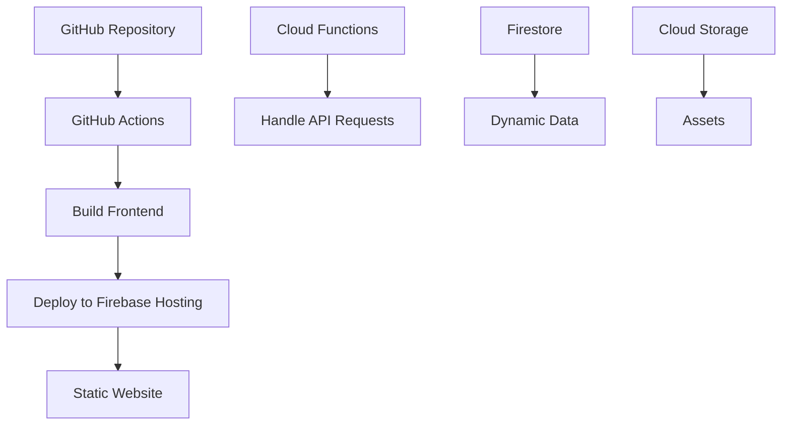
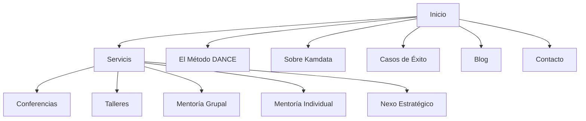

# Kamdata Website

This repository contains the code and infrastructure for the Kamdata website, a platform designed to enable professionals and teams to turn data into strategic decisions through mentoring and practical training.

## Project Overview

The Kamdata website is built using a serverless architecture on Google Cloud Platform (GCP) with Firebase integration, ensuring scalability, security, and ease of maintenance.

## Architecture

- **Frontend**: React.js with Tailwind CSS, hosted on Firebase Hosting for global CDN delivery.
- **Backend**: Cloud Functions for Firebase to handle server-side logic (e.g., form submissions).
- **Database**: Firestore for dynamic data storage (if required).
- **Storage**: Cloud Storage for large assets (if required).

### Architecture Diagram


## 🚀 Technical Specifications

### 🖥 Programming Languages

- **Frontend:** JavaScript (React.js)
- **Backend:** Node.js (Cloud Functions)
- **Infrastructure:** HCL (Terraform)

### 📦 Packages and Dependencies

#### Frontend:
```json
"react": "^18.2.0",
"react-dom": "^18.2.0",
"react-router-dom": "^6.4.0",
"tailwindcss": "^3.2.0"
```

#### Backend:
```json
"firebase-functions": "^4.0.0",
"firebase-admin": "^11.0.0"
```

#### Development Tools:
- `firebase-tools`: ^11.0.0 (global install)
- `terraform`: ^1.3.0 (for IaC)

---

### 🌐 Browserslist

Defined in `.browserslistrc`:

```
> 0.5%
last 2 versions
not dead
```

---

## 🎨 CSS & Styling

- **Framework:** Tailwind CSS
- **Fonts:** Montserrat (headings), Lato (body)
- **Configured in:** `frontend/tailwind.config.js`
- **Colors Palette:**
🎯 Hunyadi Yellow (#E8AC41) → Llamados a la acción, claridad
⚡ Strawberry (#FC4C4E) → Mentalidad digital, transformación
🔵 Cerulean (#0492C2) → Metodologías, estructura, confianza

---

## 🔒 Lockfile

- Dependency locking with `package-lock.json` ensures consistent builds.

---

## 📦 Containers

- No Docker containers are used.
- Firebase Hosting and Cloud Functions provide serverless environments.

---

## ✅ Prerequisites

Ensure the following are installed:

- Node.js and npm
- Firebase CLI (`npm install -g firebase-tools`)
- Google Cloud SDK
- Terraform (`>= 1.3.0`)
- GCP Project with **Billing Enabled**

---

## ⚙️ Setup Instructions

### 1. Clone the Repository

```bash
git clone https://github.com/username/kamdata-website.git
cd kamdata-website
```

### 2. Install Frontend Dependencies

```bash
cd frontend
npm install
```

### 3. Initialize Firebase

```bash
firebase login
firebase init
```

> Select: Hosting, Functions, Firestore (optional)  
> Link to your GCP project.

### 4. Set Up Terraform

```bash
cd terraform
terraform init
terraform apply -var "project_id=your-project-id" -var "region=us-central1"
```

---

## 💻 Local Development

### Run Frontend Locally

```bash
cd frontend
npm start
```

### Test Cloud Functions Locally

```bash
cd functions
firebase emulators:start
```

---

## 🗺️ Sitemap and Website Structure

### 📍 Sitemap (Mermaid)



### 🧱 Internal Route Structure

- `/` (Inicio)
- `/servicios`
  - `/servicios/conferencias`
  - `/servicios/talleres`
  - `/servicios/mentoria-grupal`
  - `/servicios/mentoria-individual`
  - `/servicios/nexo-estrategico`
- `/metodo-dance`
- `/sobre-kamdata`
- `/casos-exito`
- `/blog`
- `/contacto`

---


