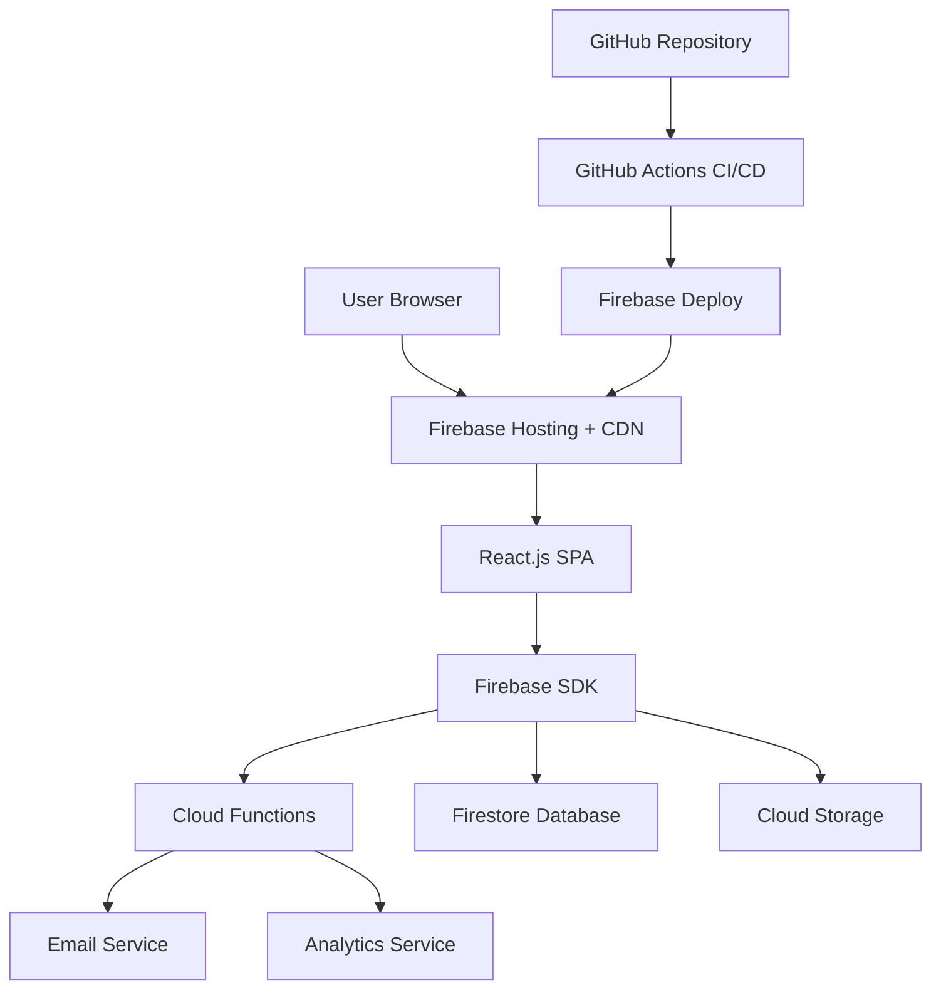
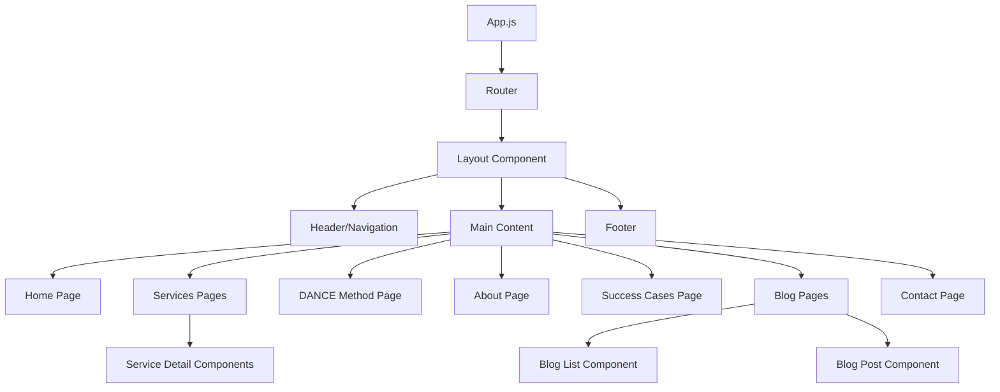

# Design Document

## Overview

The Kamdata website will be implemented as a modern, serverless web application using React.js for the frontend and Google Cloud Platform services for the backend infrastructure. The architecture prioritizes performance, scalability, and maintainability while delivering an exceptional user experience that reflects Kamdata's expertise in data-driven decision making.

## Architecture

### High-Level Architecture



### Technology Stack

**Frontend:**
- React.js 18.2.0 with functional components and hooks
- React Router DOM 6.4.0 for client-side routing
- Tailwind CSS 3.2.0 for styling and responsive design
- Framer Motion for animations and transitions

**Backend:**
- Firebase Cloud Functions (Node.js runtime)
- Firebase Admin SDK for server-side operations
- Express.js for API routing within Cloud Functions

**Database & Storage:**
- Firestore for dynamic content and form submissions
- Cloud Storage for static assets and media files

**Hosting & CDN:**
- Firebase Hosting with global CDN
- Automatic HTTPS and custom domain support

**Development & Deployment:**
- GitHub Actions for CI/CD pipeline
- Firebase CLI for local development and deployment
- Terraform for infrastructure as code

## Components and Interfaces

### Frontend Component Architecture



### Core Components

**1. Layout Components**
- `Header`: Navigation menu with responsive design
- `Footer`: Contact information and social links
- `Layout`: Wrapper component for consistent page structure

**2. Page Components**
- `HomePage`: Hero section, value proposition, service overview
- `ServicesPage`: Service categories with detailed descriptions
- `ServiceDetail`: Individual service information pages
- `DANCEMethodPage`: Interactive methodology presentation
- `AboutPage`: Company information and team
- `SuccessCasesPage`: Client testimonials and case studies
- `BlogPage`: Article listing and individual post views
- `ContactPage`: Contact form and information

**3. UI Components**
- `Button`: Styled buttons with variants (primary, secondary, outline)
- `Card`: Content containers for services and blog posts
- `Form`: Contact form with validation
- `Modal`: Overlay components for additional content
- `Animation`: Reusable animation components (compass, dots, paths)

**4. Utility Components**
- `SEOHead`: Meta tags and structured data management
- `LoadingSpinner`: Loading states
- `ErrorBoundary`: Error handling and fallback UI

### Backend API Structure

**Cloud Functions Endpoints:**
- `submitContactForm`: Handle contact form submissions
- `getBlogPosts`: Retrieve blog content from Firestore
- `getSuccessCases`: Fetch case studies and testimonials
- `sendNotification`: Email notifications for form submissions

### Data Models

**Contact Form Submission:**
```javascript
{
  id: string,
  name: string,
  email: string,
  message: string,
  service: string (optional),
  timestamp: Timestamp,
  status: 'new' | 'contacted' | 'closed'
}
```

**Blog Post:**
```javascript
{
  id: string,
  title: string,
  slug: string,
  excerpt: string,
  content: string,
  featuredImage: string,
  author: string,
  publishedAt: Timestamp,
  tags: string[],
  status: 'draft' | 'published'
}
```

**Success Case:**
```javascript
{
  id: string,
  clientName: string,
  industry: string,
  challenge: string,
  solution: string,
  results: string,
  testimonial: string,
  featured: boolean
}
```

## Components and Interfaces

### Frontend State Management

**Context Providers:**
- `ThemeContext`: Manage color scheme and visual preferences
- `NavigationContext`: Handle mobile menu state and active routes
- `FormContext`: Manage form states and validation

**Custom Hooks:**
- `useFirestore`: Firestore data fetching and caching
- `useForm`: Form validation and submission handling
- `useAnimation`: Animation state management
- `useSEO`: Dynamic meta tag updates

### Responsive Design Breakpoints

```css
/* Tailwind CSS breakpoints */
sm: 640px   /* Mobile landscape */
md: 768px   /* Tablet */
lg: 1024px  /* Desktop */
xl: 1280px  /* Large desktop */
2xl: 1536px /* Extra large */
```

### Color System Implementation

```css
/* CSS Custom Properties */
:root {
  --color-primary: #E8AC41;    /* Hunyadi Yellow */
  --color-secondary: #FC4C4E;  /* Strawberry */
  --color-accent: #0492C2;     /* Cerulean */
  --color-neutral-50: #fafafa;
  --color-neutral-900: #171717;
}
```

### Typography Scale

```css
/* Font families */
--font-heading: 'Montserrat', sans-serif;
--font-body: 'Lato', sans-serif;

/* Type scale */
--text-xs: 0.75rem;
--text-sm: 0.875rem;
--text-base: 1rem;
--text-lg: 1.125rem;
--text-xl: 1.25rem;
--text-2xl: 1.5rem;
--text-3xl: 1.875rem;
--text-4xl: 2.25rem;
```

## Error Handling

### Frontend Error Handling

**Error Boundary Implementation:**
- Catch JavaScript errors in component tree
- Display fallback UI for broken components
- Log errors to Firebase Analytics

**Form Validation:**
- Client-side validation using React Hook Form
- Real-time field validation with error messages
- Server-side validation backup in Cloud Functions

**Network Error Handling:**
- Retry logic for failed API calls
- Offline state detection and messaging
- Graceful degradation for missing content

### Backend Error Handling

**Cloud Functions Error Management:**
- Input validation and sanitization
- Structured error responses with appropriate HTTP status codes
- Error logging to Cloud Logging
- Rate limiting to prevent abuse

**Database Error Handling:**
- Firestore security rules for data protection
- Transaction handling for data consistency
- Backup and recovery procedures

## Testing Strategy

### Frontend Testing

**Unit Testing:**
- Jest and React Testing Library for component testing
- Test coverage for all utility functions and hooks
- Snapshot testing for UI consistency

**Integration Testing:**
- End-to-end testing with Cypress
- Form submission workflows
- Navigation and routing tests

**Performance Testing:**
- Lighthouse CI for performance metrics
- Bundle size monitoring
- Core Web Vitals tracking

### Backend Testing

**Cloud Functions Testing:**
- Firebase Emulator Suite for local testing
- Unit tests for business logic
- Integration tests with Firestore

**Security Testing:**
- Firestore security rules testing
- Input validation testing
- Authentication flow testing

### Accessibility Testing

**Automated Testing:**
- axe-core integration for accessibility violations
- Color contrast validation
- Keyboard navigation testing

**Manual Testing:**
- Screen reader compatibility
- Focus management verification
- ARIA attributes validation

## Performance Optimization

### Frontend Optimization

**Code Splitting:**
- Route-based code splitting with React.lazy()
- Component-level lazy loading for heavy components
- Dynamic imports for non-critical features

**Asset Optimization:**
- Image optimization with next-gen formats (WebP, AVIF)
- Lazy loading for images and videos
- CDN delivery for static assets

**Caching Strategy:**
- Service Worker for offline functionality
- Browser caching for static resources
- Firestore offline persistence

### Backend Optimization

**Cloud Functions Optimization:**
- Cold start minimization with proper function sizing
- Connection pooling for database operations
- Caching frequently accessed data

**Database Optimization:**
- Firestore indexing strategy
- Query optimization and pagination
- Data denormalization where appropriate

## Security Considerations

### Frontend Security

**Content Security Policy:**
- Strict CSP headers to prevent XSS attacks
- Trusted source definitions for scripts and styles
- Inline script restrictions

**Data Validation:**
- Client-side input sanitization
- Form validation with proper error handling
- Secure handling of user-generated content

### Backend Security

**Authentication & Authorization:**
- Firebase Authentication integration (if needed)
- Role-based access control for admin functions
- API key management and rotation

**Data Protection:**
- HTTPS enforcement across all endpoints
- Input validation and sanitization
- SQL injection prevention (NoSQL injection for Firestore)
- Rate limiting and DDoS protection

### Infrastructure Security

**Firebase Security Rules:**
```javascript
rules_version = '2';
service cloud.firestore {
  match /databases/{database}/documents {
    // Public read access for blog posts
    match /blogPosts/{document} {
      allow read: if resource.data.status == 'published';
      allow write: if request.auth != null && request.auth.token.admin == true;
    }
    
    // Restricted access for contact forms
    match /contactForms/{document} {
      allow create: if request.auth == null; // Allow anonymous submissions
      allow read, update, delete: if request.auth != null && request.auth.token.admin == true;
    }
  }
}
```

## Deployment Strategy

### CI/CD Pipeline

**GitHub Actions Workflow:**
1. Code checkout and dependency installation
2. Linting and code quality checks
3. Unit and integration test execution
4. Build optimization and bundling
5. Firebase deployment (staging/production)
6. Post-deployment verification tests

**Environment Management:**
- Development: Local Firebase emulators
- Staging: Firebase project for testing
- Production: Production Firebase project with custom domain

### Monitoring and Analytics

**Performance Monitoring:**
- Firebase Performance Monitoring
- Google Analytics 4 integration
- Core Web Vitals tracking
- Error tracking with Firebase Crashlytics

**Business Analytics:**
- User journey tracking
- Conversion funnel analysis
- Contact form submission rates
- Content engagement metrics

## Maintenance and Updates

### Content Management

**Blog Content Updates:**
- Firestore-based content management
- Admin interface for content creation
- Version control for content changes
- SEO optimization for new content

### Technical Maintenance

**Dependency Management:**
- Regular security updates
- Performance optimization reviews
- Browser compatibility testing
- Accessibility compliance audits

**Backup and Recovery:**
- Automated Firestore backups
- Code repository backup procedures
- Disaster recovery planning
- Data retention policies